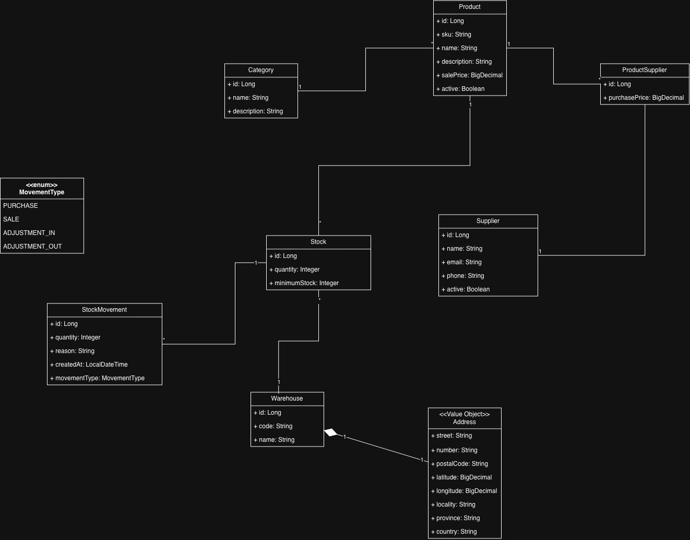

# Inventory API

REST API for inventory, warehouse and stock management built with Java and Spring Boot.

[](https://github.com/burgosfacundo/inventory-api/actions/workflows/ci.yml)

> 🚧 **Status:** In development

The goal of this project is to model real-world inventory operations while applying production-oriented backend practices such as clean separation of responsibilities, database migrations, automated testing, containerization and API documentation.

---

## 🎯 Project Goals

Inventory API manages:

- Products and categories
- Suppliers and product-supplier relationships
- Multiple warehouses
- Stock per product and warehouse
- Stock movement history
- Low-stock monitoring
- Warehouse address validation through an external geocoding service

The project intentionally goes beyond a basic CRUD API.

Stock quantities cannot be modified directly. Every stock change must be represented by a traceable inventory movement.

---

## 🧩 Domain Model

The main domain includes:

- `Product`
- `Category`
- `Supplier`
- `ProductSupplier`
- `Warehouse`
- `Address` — Value Object
- `Stock`
- `InventoryMovement`
- `StockTransfer`
- `MovementType`

### UML



---

## 🏗️ Architecture

The application is designed as a **modular monolith** using a feature-oriented package structure.

Main dependency flow:

```text
Controller
    ↓
Application Service
    ↓
Repository
    ↓
MySQL
```

External integrations are accessed through application abstractions:

```text
WarehouseService
       ↓
GeocodingService
       ↑
Geoapify Adapter
```

This keeps business logic independent from the external geocoding provider.

---

## 📦 Main Business Rules

Some of the core rules modeled by the API are:

- Product SKU must be unique.
- Supplier email must be unique.
- Warehouse code must be unique.
- Stock is unique per `Product + Warehouse`.
- Stock can never become negative.
- Stock quantity cannot be modified directly.
- Every stock change generates a traceable `InventoryMovement`.
- Outbound movements are rejected when stock is insufficient.
- The first inbound movement automatically creates the stock record.
- Manual stock adjustments require a reason.
- Stock update and movement registration occur atomically.
- Warehouse addresses must be validated before persistence.
- Physical deletion is rejected when it would destroy historical integrity.

---

## 🛠️ Planned Tech Stack

### Backend

- Java
- Spring Boot
- Spring Web
- Spring Data JPA
- Hibernate
- Jakarta Bean Validation
- Maven

### Database

- MySQL 8
- Flyway

### Testing

- JUnit 5
- Mockito
- AssertJ
- Testcontainers
- REST Assured
- JaCoCo

### API & Infrastructure

- OpenAPI / Swagger
- Docker
- Docker Compose
- Spring Boot Actuator
- GitHub Actions

### External Integration

- Geoapify

---

## 📚 Documentation

Project design documentation is available under [`docs/`](docs)

- [Requirements](docs/requirements.md)
- [API Design](docs/api-design.md)
- [Architecture](docs/architecture.md)
- [Domain Model](docs/diagrams/inventory-domain.jpg)

---

## 🌐 API

The API is versioned under:

```text
/api/v1
```

Main resources:

```text
/api/v1/categories
/api/v1/products
/api/v1/suppliers
/api/v1/product-suppliers
/api/v1/warehouses
/api/v1/stocks
/api/v1/inventory-movements
/api/v1/stock-transfers
```

### Interactive API documentation

After starting the application, the API can be explored directly through Swagger UI:

```text
http://localhost:8080/swagger-ui.html
```

OpenAPI specification:

```text
http://localhost:8080/v3/api-docs
http://localhost:8080/v3/api-docs.yaml
```

Operational endpoints:

```text
http://localhost:8080/actuator/health
http://localhost:8080/actuator/info
```

The complete design documentation is also available in:

[API Design](docs/api-design.md)

---

## 🧪 Testing Strategy

The project uses different testing levels:

- **Unit tests** for business rules and services
- **Controller tests** for HTTP contracts, validation and error responses
- **Repository integration tests** using a real MySQL container
- **API integration tests** using REST Assured
- **Infrastructure integration tests** for OpenAPI and Actuator endpoints
- **External service isolation** for Geoapify-related application tests

Integration tests use **Testcontainers with MySQL** instead of an in-memory database.

### Running tests

Run the regular test suite:

```bash
mvn test
```

Run the complete verification lifecycle:

```bash
mvn verify
```

`mvn test` executes the regular `*Test` suite through Maven Surefire.

`mvn verify` performs the complete project verification:

- runs the regular Surefire test suite
- runs `*IT` integration tests through Maven Failsafe
- starts MySQL integration environments with Testcontainers
- generates combined JaCoCo coverage from regular and integration tests
- validates the configured coverage thresholds

Docker must be running to execute the complete integration test suite locally.

### Code coverage

JaCoCo collects coverage from both regular tests and integration tests and merges the results into a single report.

The generated HTML report is available at:

```text
target/site/jacoco/index.html
```

The build enforces the following minimum project-wide coverage:

- **Line coverage:** 90%
- **Branch coverage:** 80%

If either threshold is not met, the Maven `verify` phase fails.

### Continuous Integration

GitHub Actions automatically runs the complete verification pipeline:

- on pull requests targeting `main`
- on pushes to `main`

The CI workflow:

- runs on Ubuntu
- configures Eclipse Temurin Java 25
- caches Maven dependencies
- executes `mvn --batch-mode verify`
- runs Testcontainers-based MySQL integration tests
- validates the JaCoCo coverage thresholds
- uploads the generated JaCoCo HTML report as a workflow artifact

This ensures that the project is validated in a clean environment independently from the developer machine.

---

## 🐳 Local Development with Docker

### Requirements

- Docker
- Docker Compose

### Zero-configuration demo

The Docker environment uses the `demo` Spring profile and does not require a Geoapify API key or any other external credentials.

Can clone the repository and start the complete environment directly:

```bash
docker compose up --build
```

No `.env` file is required for the demo environment.

The demo profile uses an offline `AddressValidator` implementation for Warehouse creation and updates, so no external HTTP request is made to Geoapify. Demo addresses keep the submitted address data and use placeholder coordinates.

Real Geoapify address validation remains available when running the application outside the `demo` profile. In that case, configure the required Geoapify variables using `.env.example` as a reference.

### Start the application

Run:

```bash
docker compose up --build
```

Docker Compose starts:

- Inventory API
- MySQL 8.4

The application is available at:

```text
http://localhost:8080
```

Useful URLs:

| Resource | URL |
|---|---|
| Swagger UI | http://localhost:8080/swagger-ui.html |
| OpenAPI JSON | http://localhost:8080/v3/api-docs |
| API base path | http://localhost:8080/api/v1 |
| Health | http://localhost:8080/actuator/health |
| Application info | http://localhost:8080/actuator/info |

Swagger UI is the recommended way to explore and execute requests against the demo API.

Both the API and MySQL containers include health checks.

The API waits until MySQL is healthy before starting.

### Demo environment

The Docker environment activates the `demo` Spring profile.

In this profile:

- Geoapify is not required.
- Warehouse address validation runs locally without external HTTP calls.
- Address coordinates are placeholders intended only for demo/portfolio evaluation.

Flyway automatically:

1. Creates the database schema.
2. Applies all versioned migrations.
3. Loads representative demo data.

The demo dataset includes:

- Categories
- Products
- Suppliers
- Product-supplier relationships
- Warehouses
- Stocks
- Inventory movements
- Stock transfers

This allows the API to be explored immediately after startup.

### Stop the application

```bash
docker compose down
```

To also remove the MySQL persistent volume:

```bash
docker compose down -v
```

A subsequent:

```bash
docker compose up --build
```

will recreate the database from scratch using Flyway.

---

## 🗺️ Roadmap

- [x] Domain modeling
- [x] Functional and business requirements
- [x] REST API contract
- [x] Architecture definition
- [x] Spring Boot project setup
- [x] MySQL + Flyway configuration
- [x] Product and Category implementation
- [x] Supplier management
- [x] Product-Supplier management
- [x] Warehouse management
- [x] Geoapify integration
- [x] Stock management
- [x] Inventory movements and transactional rules
- [x] Warehouse stock transfers
- [x] Unit tests
- [x] Integration tests with Testcontainers
- [x] REST API tests with REST Assured
- [x] Docker Compose
- [x] Docker demo environment
- [x] OpenAPI / Swagger documentation
- [x] GitHub Actions CI
- [x] JaCoCo coverage
- [ ] Final documentation review

---

## 👨‍💻 Author

**Facundo Burgos**

- GitHub: [@burgosfacundo](https://github.com/burgosfacundo)
- LinkedIn: [linkedin.com/in/burgosfacundo](https://www.linkedin.com/in/burgosfacundo/)